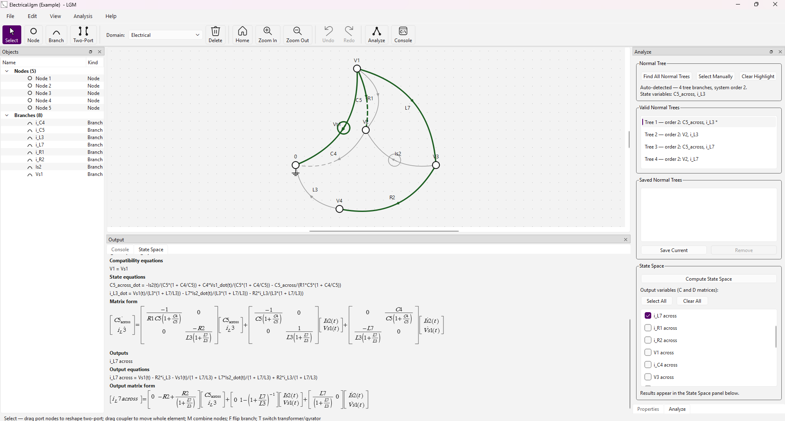

# Linear Graph Modeling (LGM)

A Qt6 desktop editor for **MIT-style linear graphs**: draw nodes, directed branches, and two-port elements on a snapping grid, then derive **normal trees** and **state-space equations** from the model.

The app targets coursework-style system dynamics (mechanical, electrical, fluid, thermal, and rotational domains) following the linear graph formulation used in MIT 2.151.



**Download:** [v0.1.12](https://github.com/FurkanKaraketir/LGM/releases/tag/v0.1.12) — Windows installer or portable zip, macOS `.dmg` or portable zip, Linux AppImage.

## Features

| Area | What it does |
|------|----------------|
| [Canvas editor](docs/canvas.md) | CAD-style graph drawing, selection, undo/redo, `.lgm` files |
| [Graph model](docs/model.md) | Branch types (A/T/D), domains, elemental equations, two-ports |
| [Analysis](docs/analysis.md) | Normal-tree search, manual tree selection, state-space derivation |
| [Examples](Examples/README.md) | Sample `.lgm` graphs (motor, RLC, transformer cascade) |

In-app guides: **Help → Guides** (Quick Start, State-Space Derivation).

## License

Copyright (C) 2026 Furkan Karaketir

This program is free software under the [GNU General Public License v3.0](https://www.gnu.org/licenses/gpl-3.0.html) (or later). See [COPYING](COPYING).

## Requirements

- CMake 3.16+
- Qt 6.11 (Widgets, Network) — same version as CI and `CMakePresets.json` `windows-mingw`
- C++17 compiler (MinGW or MSVC on Windows)
- [vcpkg](https://vcpkg.io/) (Boost.Multiprecision)
- Network access on first configure (SymEngine and JKQtPlotter are fetched via CMake `FetchContent`)

## Build (Windows, Qt MinGW)

Machine-specific Qt/vcpkg paths are in the `windows-mingw` preset in `CMakePresets.json`. Edit that preset if your install paths differ (or copy `CMakeUserPresets.json.example` to `CMakeUserPresets.json` and add overrides).

**Configure once**:

   ```powershell
   cmake --preset windows-mingw
   ```

**Build and run** (day to day):

   ```powershell
   cmake --build build
   .\build\LGM.exe
   ```

`windeployqt` runs automatically after the build when available, copying Qt runtime DLLs next to the executable.

## Releases and updates

Tagged releases (`v0.1.12` is the latest) are built for Windows, macOS, and Linux via GitHub Actions and published on [GitHub Releases](https://github.com/FurkanKaraketir/LGM/releases).

| Platform | Installer | Portable |
|----------|-----------|----------|
| Windows | `LGM-x.y.z-win64-setup.exe` | `LGM-x.y.z-win64-portable.zip` |
| macOS | `LGM-x.y.z-macos.dmg` | `LGM-x.y.z-macos-portable.zip` |
| Linux | `LGM-x.y.z-linux-x86_64.AppImage` | — |

- Maintainer guide: [docs/releases.md](docs/releases.md)
- In-app: **Help → Check for Updates**

## Quick workflow

1. Pick a **domain** from the toolbar (or **Settings**).
2. Draw the graph: nodes, branches, two-ports.
3. Edit names, constants, and branch types in the **Properties** dock.
4. Open **Analyze** → find or select a **normal tree** → **Compute State Space**.
5. Review equations in the **State Space** dock (LaTeX via JKQtMathText).

See [docs/canvas.md](docs/canvas.md) for controls and [docs/analysis.md](docs/analysis.md) for the analysis pipeline.

## Project layout

```
CMakeLists.txt          # build + vcpkg / FetchContent deps
Examples/               # sample .lgm graphs
docs/                   # feature docs + algorithm reference
src/
  canvas/               # GraphScene, items, view, document I/O
  model/                # normal tree, elemental equations, state space
  ui/                   # MainWindow, Analyze panel, settings, guides
  assets/               # icons, guides, app icon
```

## Background reading

Course handouts in the repo root (not part of the build):

- `LinearGrpahModelingBasics.txt` — state equations from linear graphs
- `TwoPortsBasics.txt` — transformers, gyrators, multi-domain graphs

Algorithm detail (developer reference with source links): [docs/state_space_from_normal_tree.md](docs/state_space_from_normal_tree.md). In-app guide: **Help → Guides → State-Space Derivation** (logic only, no file links).
