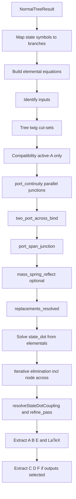

# State-Space Derivation After the Normal Tree

This document is the **GitHub / developer reference** (with links into the source tree). The in-app guide under **Help → Guides** uses a link-free copy: `src/assets/guides/state_space_from_normal_tree.md`.

This describes **what the current implementation does** when it derives a state-space representation, starting from a committed normal tree. It follows [`src/model/state_space/state_space.cpp`](../src/model/state_space/state_space.cpp) (`computeStateSpaceImpl`) and uses [`Examples/Motor.lgm`](../Examples/Motor.lgm) as a worked example.

The goal is algorithmic transparency, not error diagnosis.

---

## Prerequisites

State-space derivation assumes a valid `NormalTreeResult` (`status == Ok`) produced after normal-tree branches are decided (automatically or manually). That result carries:

| Field | Meaning |
|-------|---------|
| `treeBranches` | Branches chosen as **tree twigs** (spanning tree) |
| `stateVariables` | Storage symbols assigned by [`populateNormalTreeStateVariables`](../src/model/normal_tree/normal_tree.cpp) (via internal `extractStateVariables`) |

**Out of scope here:** how the normal tree is searched, scored, or validated ([`computeNormalTree`](../src/model/normal_tree/normal_tree.cpp), two-port port assignments, manual selection). Those steps must complete successfully first.

**Entry point in the UI/scene:** [`GraphScene::computeStateSpaceRep`](../src/canvas/scene/scene_normal_tree.cpp) → [`lg::computeStateSpace`](../src/model/state_space/state_space.cpp).

---

## Overview



The pipeline in `computeStateSpaceImpl`:

1. Builds **elemental** constitutive equations in **node-across** form (`V1−V2`, `V2−V3`, `OmegaJ`, …).
2. Records **continuity** flow replacements from tree cut-sets, then **port-span parallel** junctions (`port_continuity`).
3. Records **compatibility** as one binding per active A-type source (`V_node = u`).
4. Adds **across-only** two-port bindings (`two_port_across_bind`), then **port-span inertia** junctions (`port_span_junction`).
5. Optionally reflects co-tree compliance through transformer chains (`mass_spring_reflect`).
6. Solves storage elementals for `state_dot`, then **eliminates** remaining node/branch symbols (with coupling resolve and refine passes).
7. Builds state matrix form `ẋ = A x + B u [+ E u̇]`, then — when output variables are selected in the **Analyze** panel — output matrix form `y = C x + D u [+ F u̇]`.

**Important:** `recordConstraint` never overwrites a symbol already set by continuity or compatibility. Two-port **flow** relations (`i1 = −Ka·T2`) are **not** duplicated into `replacements` — they remain in the elemental set only, avoiding conflicts such as overwriting `i1 = i_L`.

---

## Branch types (MIT linear graph)

Passive branch behavior is classified as **A**, **T**, or **D** ([`elemental_equation/`](../src/model/elemental_equation/)). Constants infer type when the branch is still at default A-type (e.g. `R`→D, `L`→T, `J`→A).

| Type | Physical role | Elemental equation (generic) | State when… |
|------|---------------|------------------------------|-------------|
| **A** | Inertia, capacitance | `f = k·ẋ` | **In tree** → across variable is a state |
| **T** | Inductance, compliance | `Δe = k·ẋ_flow` | **In co-tree (link)** → through variable is a state |
| **D** | Resistance, damping | `f = k·e` (algebraic) | Never a state |

Active sources: **A-type in tree** → effort input; **T-type in co-tree** → flow input.

Two-port transformers add elemental constraints on port across and through variables (modulus `k`, e.g. `1/Ka`).

---

## Motor.lgm

A permanent-magnet DC motor sketch: electrical side (`R`, `L`, voltage source `Vs1`), transformer (`1/Ka`), mechanical side (`J`, `B`).

### Graph elements

| Element | Branch name | Stored type | Normal-tree role |
|---------|-------------|-------------|------------------|
| Voltage source | `Vs1` | A (active) | Tree twig → **input** |
| Resistor `R` | `i_R` | D | Tree twig |
| Inductor `L` | `i_L` | T | Co-tree link → **state** `i_L` |
| Transformer | port branches `i1`, `T2` | two-port (`1/Ka`) | Left port `i1` in tree; right port in co-tree |
| Inertia `J` | `T_J` | A | Tree twig → **state** `OmegaJ` |
| Damper `B` | `T_B` | D | Co-tree link |

### Normal tree result (auto)

- **Tree twigs (4):** `Vs1`, `i1`, `T_J`, `i_R`
- **Co-tree links:** `i_L`, `T_B`, transformer right port (`T2`)
- **State variables:** `OmegaJ` (across, from tree inertia `T_J`), `i_L` (through, from co-tree inductor)
- **Input:** `Vs1`

---

## Phase-by-phase algorithm

Each phase lists **what**, **where in code**, and **Motor.lgm** log output. Logs are emitted by [`ss::ssLog`](../src/model/state_space_sym.cpp) to Qt debug output (`[state_space] …`) when you run **Compute State Space** in the app.

### Phase A — Validate and map states

**Where:** start of `computeStateSpaceImpl` — status checks, then state→branch mapping.

Maps each `tree.stateVariables` entry to its storage branch via [`ss::isStateBranch`](../src/model/state_space_graph.cpp) / [`ss::storageStateSymbol`](../src/model/state_space_graph.cpp).

**Motor.lgm:** `OmegaJ ↔ T_J`, `i_L ↔ i_L`.

```
[state_space] begin - states=[OmegaJ (T_J), i_L (i_L)] tree_branches=4
```

---

### Phase B — Elemental equations

**What:** Constitutive laws using [`branchNodeAcrossExpr`](../src/model/elemental_equation/symbols.cpp) — node-across differences from [`branchAcrossVariableText`](../src/model/elemental_equation/naming.cpp), not synthetic `*_a` symbols.

**Where:** passive branch loop (`build_elementals`), then two-port elementals (`two_port_elementals`).

**Motor.lgm** — human-readable (`elemental_text`):

```
T_J = J*OmegaJ_dot; T_B = B*OmegaJ; V2 - V3 = L*i_L_dot; i_R = (V1 - V2)/R; V3 = OmegaJ/Ka; i1 = -T2*Ka
```

Unreduced symbolic (`elemental`):

```
0 = T_J - J*OmegaJ_dot
0 = T_B - B*OmegaJ
0 = i_L_dot - V2/L + V3/L
0 = i_R - V1/R + V2/R
0 = V3 - OmegaJ/Ka
0 = i1 + T2*Ka
```

---

### Phase C — Inputs

**Where:** loop over active branches after elementals; logs `inputs`.

A-type active branch **in tree** → effort input. T-type active branch **in co-tree** → flow input.

**Motor.lgm:** `Vs1`.

---

### Phase D — Continuity (cut-sets and port parallel)

**What:** Flow replacements from (1) **tree twig cut-sets** and (2) **port-span parallel junctions** (`port_continuity`).

**Where:** `continuity_cuts` / `continuity_twig` loop, then `port_continuity`; aggregated list logged as `continuity`.

**Tree twig cuts** (unless skipped):

- Skip active A-type sources (`Vs1`).
- Skip port-span user branches via [`skipTwigFlowContinuity`](../src/model/elemental_equation/topology.cpp) — e.g. `T_J` on the transformer mechanical span uses the port-span junction instead of a cut-set on the twig.

For each remaining twig: partition graph at a cut, sum signed through-flows, solve for the twig flow → `recordReplacement` into `continuityEquations`.

**Port-span parallel junction:** for a co-tree port with user branches on the same nodes (e.g. `T_B`, `T_J` parallel to port `T2`):

```
port_flow = −(sum of parallel branch flows)
```

**Motor.lgm** — logged at `[state_space] continuity` (after cut-sets + port parallel):

```
i1 = i_L
i_R = i_L
T2 = -T_B - T_J
```

---

### Phase E — Compatibility (active A-type only)

**What:** One equation per active A-type source in the tree: non-reference node across = input symbol.

**Where:** loop after cut-sets, before `port_continuity`; results in `compatibilityEquations`, logged as `compatibility_eqs`.

No KVL loop solves on co-tree links. Node across variables (`V2`, `V3`, …) stay as symbols until Phase H elimination.

**Motor.lgm:**

```
V1 = Vs1
```

---

### Phase F — Two-port across, port-span inertia, mass–spring reflect

**Where:** `two_port_across_bind` (with cascade propagation passes), `port_span_junction`, `mass_spring_reflect`.

| Rule | Recorded as | Notes |
|------|-------------|-------|
| Transformer **across** | `V3 = OmegaJ/Ka` via `recordConstraint` | Flow relations **not** duplicated here |
| Port-span A-type storage (`T_J`) | `T_J = -T_B + i1/Ka` → `continuityEquations` | Uses reflected port current; runs in `port_span_junction` |
| `recordConstraint` | Skips if symbol already in `replacements` | Protects `i1 = i_L` from being overwritten by `i1 = -Ka·T2` |
| Mass + co-tree compliance | `mass_spring_reflect` | Optional; reflects T-type link through transformer chain into tree mass flow (not used on Motor.lgm) |

Two-port **flows** (`i1 = −Ka·T2`) remain **only** in elementals (Phase B). Putting them into `replacements` on top of continuity caused circular resolves (`T_J = T_J`) and corrupted `state_dot` elimination.

After all constraint phases, `replacements_resolved` logs the chained map:

**Motor.lgm:**

```
T_J = -T_B + i_L/Ka
V3 = OmegaJ/Ka
T2 = -i_L/Ka
V1 = Vs1
i_R = i_L
i1 = i_L
```

---

### Phase G — Derive `state_dot`

**Where:** `substitute_elementals`, `match_state_dots`, `matched` / `state_dot_initial`.

1. `valueSubMap` / `subMap` from resolved `replacements`.
2. Log `elemental`, `reduced_elemental` (after `subMap`).
3. For each storage elemental, [`solveLinearFor`](../src/model/state_space_sym.cpp) on the **`valueSubMap`**-reduced form.

**Motor.lgm:**

| Stage | `OmegaJ_dot` | `i_L_dot` |
|-------|--------------|-----------|
| `reduced_elemental` (T_J row) | `0 = -T_B - J·OmegaJ_dot + i_L/Ka` | — |
| `state_dot_initial` | `(−T_B + i_L/Ka) / J` | `V2/L − OmegaJ/(L·Ka)` |
| `state_dot_after_value_sub` | `−B·OmegaJ/J + i_L/(J·Ka)` | `Vs1/L − OmegaJ/(L·Ka) − R·i_L/L` |

`state_dot_after_value_sub` applies `valueSubMap` (`T_B = B·OmegaJ` from algebraics, `V1 = Vs1`, `i_R = i_L`) and eliminates `V2` via the resistor elemental.

---

### Phase H — Symbol elimination and coupling

**Where:** [`state_space_eliminate.cpp`](../src/model/state_space_eliminate.cpp) — `eliminateBranchSymbolsInto`, `eliminateSymbolsInto`, `resolveStateDotCoupling`, `refine_pass`, `final_sub`.

Eliminates branch flows and **node across** symbols from `stateDots` using algebraics, constraint relations, and guarded substitution (`acceptStateDotSubstitution`). Coupling resolve may run twice; up to four refine passes follow.

**Motor.lgm** — after first elimination pass (`pre_coupling` / `state_dot`):

```
OmegaJ_dot = -B*OmegaJ/J + i_L/(J*Ka)
i_L_dot    = Vs1/L - OmegaJ/(L*Ka) - R*i_L/L
```

Both depend only on `{OmegaJ, i_L, Vs1}` → validation passes.

---

### Phase I — State matrix form

**Where:** [`ssAssembleMatrix`](../src/model/state_space/state_space_matrix.cpp) — `state_equation`, `matrix_form`.

Builds `stateEquations` and LaTeX `ẋ = A x + B u [+ E u̇]`.

**Motor.lgm:** succeeds (`status: Ok`, state order 2).

---

### Phase J — Output equations (C and D matrices)

**Where:** [`ssAssembleOutputs`](../src/model/state_space/state_space_matrix.cpp) — runs after Phase I when the user selects one or more **output variables** in the **Analyze** dock (node across, branch through, and other graph observables).

For each selected output symbol, the implementation:

1. Seeds an expression from replacements, branch elementals, or constitutive relations.
2. Eliminates non-state symbols using the same reduction machinery as state-dot derivation.
3. Verifies the result is **linear** in states, inputs, and input derivatives.
4. Appends a scalar `output = …` equation and fills rows of **C**, **D**, and (when needed) **F**.

LaTeX output: `y = C x + D u [+ F u̇]` (`output_matrix_form` log tag). If no outputs are selected, this phase is skipped and the **State Space** dock shows only the state matrix.

**Motor.lgm** — with outputs `OmegaJ` and `i_L` selected, expect non-trivial **C** (e.g. `OmegaJ` as a state maps to itself) and **D** (direct feedthrough from `Vs1` when applicable). Exact coefficients depend on the chosen observables.

---

## Diagnostic log map

Run **Analyze → Compute State Space** (or `Ctrl+Shift+S`) with Qt debug output enabled (e.g. run from a terminal, or set `QT_LOGGING_RULES=*.debug=true`). Tags are printed as `[state_space] <tag> - <detail>`.

| Log tag | Phase | Meaning |
|---------|-------|---------|
| `begin` | A | States and tree size |
| `build_elementals` / `two_port_elementals` | B | Elemental construction |
| `elemental_text` | B | Human-readable constitutive equations |
| `inputs` | C | Input symbols |
| `continuity_cuts` / `continuity_twig` | D | Per-twig cut-set progress |
| `port_continuity` | D | Port-span parallel junctions |
| `continuity` | D | Full `continuityEquations` list |
| `compatibility_eqs` | E | Active A-type node bindings |
| `two_port_across_bind` | F | Across-only two-port constraints |
| `port_span_junction` | F | Port-span A-type storage junctions |
| `mass_spring_reflect` | F | Mass/compliance reflection (if applicable) |
| `replacements` / `replacements_resolved` | F→G | Raw count and chained replacement map |
| `elemental` | G | Unreduced `0 = …` elementals |
| `reduced_elemental` | G | Elementals after `subMap` |
| `matched` | G | Storage elemental → `state_dot` solve |
| `state_dot_initial` | G | Right after solve, before elimination |
| `state_dot_after_value_sub` | H | After `valueSubMap` on `stateDots` |
| `pre_coupling` / `state_dot` | H | After first elimination pass |
| `coupling` | H | `resolveStateDotCoupling` progress |
| `refine_pass` | H | Post-coupling refinement |
| `state_equation` | I | Final scalar state equations |
| `matrix_form` | I | LaTeX state matrix `ẋ = A x + B u [+ E u̇]` |
| `output_equation` | J | Scalar output equation per selected variable |
| `output_matrix_form` | J | LaTeX output matrix `y = C x + D u [+ F u̇]` |
| `ok` | I–J | Success and state order |

---

## Result fields

| Field | Content |
|-------|---------|
| `elementalEquations` | Node-across constitutive laws (Phase B) |
| `continuityEquations` | Flow replacements (cut-sets, port junctions, port-span inertia) |
| `compatibilityEquations` | Active A-type node bindings only |
| `stateEquations` | Final `symbol_dot = …` |
| `matrixForm` | LaTeX `ẋ = A x + B u [+ E u̇]` |
| `outputs` / `outputLabels` | Selected output symbols and display labels (Phase J) |
| `outputEquations` | Final `y_i = …` scalar equations |
| `outputMatrixForm` | LaTeX `y = C x + D u [+ F u̇]` |

---

## Source file index

| File | Role |
|------|------|
| [`src/model/state_space/state_space.cpp`](../src/model/state_space/state_space.cpp) | Main orchestration (`computeStateSpaceImpl`) |
| [`src/model/state_space/state_space_constraints.cpp`](../src/model/state_space/state_space_constraints.cpp) | Elementals, continuity, compatibility |
| [`src/model/state_space/state_space_states.cpp`](../src/model/state_space/state_space_states.cpp) | State-dot derivation and elimination passes |
| [`src/model/state_space_graph.cpp`](../src/model/state_space_graph.cpp) | Cut-sets, state-branch helpers |
| [`src/model/elemental_equation/`](../src/model/elemental_equation/) | `branchNodeAcrossExpr`, symbols, port-span helpers |
| [`src/model/state_space_eliminate.cpp`](../src/model/state_space_eliminate.cpp) | Elimination and coupling resolve |
| [`src/model/state_space_sym.cpp`](../src/model/state_space_sym.cpp) | `resolveReplacements`, linear solve, `ssLog` |
| [`src/model/state_space/state_space_matrix.cpp`](../src/model/state_space/state_space_matrix.cpp) | State matrix (A, B, E) and output matrix (C, D, F) assembly |
| [`src/model/state_space_latex.cpp`](../src/model/state_space_latex.cpp) | LaTeX matrix formatting |
| [`src/model/normal_tree/`](../src/model/normal_tree/) | Normal tree search and state-variable selection |

---

## Summary

For `Examples/Motor.lgm` with tree `[Vs1, i1, T_J, i_R]`:

1. **Elementals** tie branches to node efforts (`V1−V2`, `V2−V3`, `OmegaJ`, …) and two-port laws.
2. **Continuity** sets `i1 = i_L`, `i_R = i_L`, `T2 = −T_B − T_J`, and (port-span) `T_J = −T_B + i_L/Ka`.
3. **Compatibility** sets `V1 = Vs1` only.
4. **Two-port across** adds `V3 = OmegaJ/Ka`; flows are **not** re-bound in `replacements`.
5. **State equations** emerge as standard DC-motor dynamics coupled through `Ka`, `J`, `L`, `R`, `B`.
6. **Output equations** (optional) — check observables in **Analyze → Output variables**, then recompute to get **C** and **D** (and **F** if input-derivative feedthrough remains).
