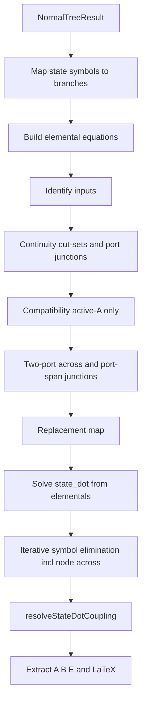

# State-Space Derivation After the Normal Tree

This document describes **what the current implementation does** when it derives a state-space representation, starting from a committed normal tree. It follows [`src/model/state_space.cpp`](../src/model/state_space.cpp) (`computeStateSpaceImpl`) and uses [`Motorexample.lgm`](../Motorexample.lgm) as a worked example.

The goal is algorithmic transparency, not error diagnosis.

---

## Prerequisites

State-space derivation assumes a valid `NormalTreeResult` (`status == Ok`) produced after normal-tree branches are decided (automatically or manually). That result carries:

| Field | Meaning |
|-------|---------|
| `treeBranches` | Branches chosen as **tree twigs** (spanning tree) |
| `stateVariables` | Storage symbols assigned by [`extractStateVariables`](../src/model/normal_tree.cpp) |

**Out of scope here:** how the normal tree is searched, scored, or validated ([`computeNormalTree`](../src/model/normal_tree.cpp), two-port port assignments, manual selection). Those steps must complete successfully first.

**Entry point in the UI/scene:** [`GraphScene::computeStateSpaceRep`](../src/canvas/canvas_scene_graph.cpp) → [`lg::computeStateSpace`](../src/model/state_space.cpp).

---

## Overview



The pipeline:

1. Builds **elemental** constitutive equations in **node-across** form (`V1−V2`, `V2−V3`, `OmegaJ`, …).
2. Records **continuity** flow replacements from tree cut-sets and port-span junctions.
3. Records **compatibility** as one binding per active A-type source (`V_node = u`).
4. Adds **across-only** two-port bindings to `replacements` (port flows stay in elementals + continuity).
5. Solves storage elementals for `state_dot`, then **eliminates** remaining node/branch symbols.

**Important:** `recordConstraint` never overwrites a symbol already set by continuity or compatibility. Two-port **flow** relations (`i1 = −Ka·T2`) are **not** duplicated into `replacements` — they remain in the elemental set only, avoiding conflicts such as overwriting `i1 = i_L`.

---

## Branch types (MIT linear graph)

Passive branch behavior is classified as **A**, **T**, or **D** ([`elemental_equation.cpp`](../src/model/elemental_equation.cpp)). Constants infer type when the branch is still at default A-type (e.g. `R`→D, `L`→T, `J`→A).

| Type | Physical role | Elemental equation (generic) | State when… |
|------|---------------|------------------------------|-------------|
| **A** | Inertia, capacitance | `f = k·ẋ` | **In tree** → across variable is a state |
| **T** | Inductance, compliance | `Δe = k·ẋ_flow` | **In co-tree (link)** → through variable is a state |
| **D** | Resistance, damping | `f = k·e` (algebraic) | Never a state |

Active sources: **A-type in tree** → effort input; **T-type in co-tree** → flow input.

Two-port transformers add elemental constraints on port across and through variables (modulus `k`, e.g. `1/Ka`).

---

## Motorexample.lgm

A permanent-magnet DC motor sketch: electrical side (`R`, `L`, voltage source `Vs1`), transformer (`1/Ka`), mechanical side (`J`, `B`).

### Graph elements

| Element | Branch name | Stored type | Normal-tree role |
|---------|-------------|-------------|------------------|
| Voltage source | `Vs1` | A (active) | Tree twig → **input** |
| Resistor `R` | `i_R` | D | Tree twig |
| Inductor `L` | `i_L` | T | Co-tree link → **state** `i_L` |
| Transformer | port branches `i1`, `T2` | two-port (`1/Ka`) | Left port `i1` in tree; right port in co-tree |
| Inertia `J` | `T_J` | A | Tree twig → **state** `OmegaJ` |
| Damper `B` | `T_B` | D | Co-tree link |

### Normal tree result (auto)

- **Tree twigs (4):** `Vs1`, `i1`, `T_J`, `i_R`
- **Co-tree links:** `i_L`, `T_B`, transformer right port (`T2`)
- **State variables:** `OmegaJ` (across, from tree inertia `T_J`), `i_L` (through, from co-tree inductor)
- **Input:** `Vs1`

---

## Phase-by-phase algorithm

Each phase lists **what**, **why**, **code**, and **Motorexample** log output (`-v`).

### Phase A — Validate and map states

**Code:** Lines 63–113.

Maps each `tree.stateVariables` entry to its storage branch via [`ss::isStateBranch`](../src/model/state_space_graph.cpp) / [`ss::storageStateSymbol`](../src/model/state_space_graph.cpp).

**Motorexample:** `OmegaJ ↔ T_J`, `i_L ↔ i_L`.

```
[state_space] begin - states=[OmegaJ (T_J), i_L (i_L)] tree_branches=4
```

---

### Phase B — Elemental equations

**What:** Constitutive laws using [`branchEffortExpr`](../src/model/elemental_equation.cpp) — node-across differences from [`branchAcrossVariableText`](../src/model/elemental_equation.cpp), not synthetic `*_a` symbols.

**Code:** Lines 166–236.

**Motorexample** — human-readable (`elemental_text`):

```
T_J = J*OmegaJ_dot; T_B = B*OmegaJ; V2 - V3 = L*i_L_dot; i_R = (V1 - V2)/R; V3 = OmegaJ/Ka; i1 = -T2*Ka
```

Unreduced symbolic (`elemental`):

```
0 = T_J - J*OmegaJ_dot
0 = T_B - B*OmegaJ
0 = i_L_dot - V2/L + V3/L
0 = i_R - V1/R + V2/R
0 = V3 - OmegaJ/Ka
0 = i1 + T2*Ka
```

---

### Phase C — Inputs

**Code:** Lines 238–254.

A-type active branch **in tree** → effort input.

**Motorexample:** `Vs1`.

---

### Phase D — Continuity equations

**What:** Flow replacements from (1) **tree twig cut-sets** and (2) **port-span parallel junctions**.

**Code:** Lines 260–372.

**Tree twig cuts** (unless skipped):

- Skip active A-type sources (`Vs1`).
- Skip port-span user branches via [`skipTwigFlowContinuity`](../src/model/elemental_equation.cpp) — e.g. `T_J` on the transformer mechanical span uses the port-span junction instead of a cut-set on the twig.

For each remaining twig: partition graph at a cut, sum signed through-flows, solve for the twig flow → `recordReplacement` into `continuityEquations`.

**Port-span parallel junction** (Phase F first part): for a co-tree port with user branches on the same nodes (e.g. `T_B`, `T_J` parallel to port `T2`):

```
port_flow = −(sum of parallel branch flows)
```

**Motorexample** — logged at `[state_space] continuity` (after cut-sets + port parallel):

```
i1 = i_L
i_R = i_L
T2 = -T_B - T_J
```

**Port-span inertia junction** (later in Phase F): `T_J` on the mechanical port span is tied to reflected electrical current and `T_B`:

```
T_J = -T_B + i_L/Ka
```

This is recorded to `continuityEquations` after the continuity log line; it appears in the resolved replacement map (with `i1` already folded to `i_L`).

---

### Phase E — Compatibility (active A-type only)

**What:** One equation per active A-type source in the tree: non-reference node across = input symbol.

**Code:** Lines 316–341.

No KVL loop solves on co-tree links. Node across variables (`V2`, `V3`, …) stay as symbols until Phase H elimination.

**Motorexample:**

```
V1 = Vs1
```

---

### Phase F — Two-port across and port-span junctions

**Code:** Lines 343–502.

| Rule | Recorded as | Notes |
|------|-------------|-------|
| Transformer **across** | `V3 = OmegaJ/Ka` via `recordConstraint` | Flow relations **not** duplicated here |
| Port-span A-type storage (`T_J`) | `T_J = -T_B + i1/Ka` → `continuityEquations` | Uses reflected port current |
| `recordConstraint` | Skips if symbol already in `replacements` | Protects `i1 = i_L` from being overwritten by `i1 = -Ka·T2` |

Two-port **flows** (`i1 = −Ka·T2`) remain **only** in elementals (Phase B). Putting them into `replacements` on top of continuity caused circular resolves (`T_J = T_J`) and corrupted `state_dot` elimination.

**Motorexample** — full resolved map (`replacements_resolved`):

```
T_J = -T_B + i_L/Ka
V3 = OmegaJ/Ka
T2 = -i_L/Ka
V1 = Vs1
i_R = i_L
i1 = i_L
```

---

### Phase G — Derive `state_dot`

**Code:** Lines 585–665.

1. `valueSubMap` / `subMap` from resolved `replacements`.
2. Log `elemental`, `reduced_elemental` (after `subMap`).
3. For each storage elemental, [`solveLinearFor`](../src/model/state_space_sym.cpp) on the **`valueSubMap`**-reduced form.

**Motorexample:**

| Stage | `OmegaJ_dot` | `i_L_dot` |
|-------|--------------|-----------|
| `reduced_elemental` (T_J row) | `0 = -T_B - J·OmegaJ_dot + i_L/Ka` | — |
| `state_dot_initial` | `(−T_B + i_L/Ka) / J` | `V2/L − OmegaJ/(L·Ka)` |
| `state_dot_after_value_sub` | `−B·OmegaJ/J + i_L/(J·Ka)` | `Vs1/L − OmegaJ/(L·Ka) − R·i_L/L` |

`state_dot_after_value_sub` applies `valueSubMap` (`T_B = B·OmegaJ` from algebraics, `V1 = Vs1`, `i_R = i_L`) and eliminates `V2` via the resistor elemental.

---

### Phase H — Symbol elimination

**Code:** Lines 667–1048; [`state_space_eliminate.cpp`](../src/model/state_space_eliminate.cpp).

Eliminates branch flows and **node across** symbols from `stateDots` using algebraics, constraint relations, and guarded substitution (`acceptStateDotSubstitution`).

**Motorexample** — final (`pre_coupling` / `state_dot`):

```
OmegaJ_dot = -B*OmegaJ/J + i_L/(J*Ka)
i_L_dot    = Vs1/L - OmegaJ/(L*Ka) - R*i_L/L
```

Both depend only on `{OmegaJ, i_L, Vs1}` → validation passes.

---

### Phase I — Matrix form and output

**Code:** Lines 1050–1157.

Builds `stateEquations` and LaTeX `ẋ = A x + B u [+ E u̇]`.

**Motorexample:** succeeds (`status: Ok`, state order 2).

---

## Diagnostic log map (`-v`)

```bash
cmake --build build
build/state_space_smoke.exe Motorexample.lgm -v
```

| Log tag | Phase | Meaning |
|---------|-------|---------|
| `begin` | A | States and tree size |
| `inputs` | C | Input symbols |
| `continuity` | D (+ part of F) | Cut-set and port-parallel flow replacements |
| `replacements` / `replacements_resolved` | After D–F | Raw count and chained replacement map |
| `elemental_text` | B | Human-readable constitutive equations |
| `elemental` | B | Unreduced `0 = …` elementals |
| `reduced_elemental` | G | Elementals after `subMap` |
| `matched` | G | Storage elemental → `state_dot` solve |
| `state_dot_initial` | G | Right after solve, before elimination |
| `state_dot_after_value_sub` | H | After `valueSubMap` on `stateDots` |
| `state_dot` / `pre_coupling` | H | After first elimination pass |
| Step 8 (smoke) | D | `result.continuityEquations` |
| Step 9 (smoke) | E | `result.compatibilityEquations` |

---

## Result fields

| Field | Content |
|-------|---------|
| `elementalEquations` | Node-across constitutive laws (Phase B) |
| `continuityEquations` | Flow replacements (cut-sets, port junctions, port-span inertia) |
| `compatibilityEquations` | Active A-type node bindings only |
| `stateEquations` | Final `symbol_dot = …` |
| `matrixForm` | LaTeX `ẋ = A x + B u [+ E u̇]` |

---

## Source file index

| File | Role |
|------|------|
| [`src/model/state_space.cpp`](../src/model/state_space.cpp) | Main orchestration |
| [`src/model/elemental_equation.cpp`](../src/model/elemental_equation.cpp) | `branchEffortExpr`, symbols, port-span helpers |
| [`src/model/state_space_eliminate.cpp`](../src/model/state_space_eliminate.cpp) | Elimination and coupling resolve |
| [`src/model/state_space_sym.cpp`](../src/model/state_space_sym.cpp) | `resolveReplacements`, linear solve |
| [`src/model/normal_tree.cpp`](../src/model/normal_tree.cpp) | Normal tree and state-variable selection |
| [`tools/state_space_smoke.cpp`](../tools/state_space_smoke.cpp) | Headless walkthrough |

---

## Summary

For `Motorexample.lgm` with tree `[Vs1, i1, T_J, i_R]`:

1. **Elementals** tie branches to node efforts (`V1−V2`, `V2−V3`, `OmegaJ`, …) and two-port laws.
2. **Continuity** sets `i1 = i_L`, `i_R = i_L`, `T2 = −T_B − T_J`, and (port-span) `T_J = −T_B + i_L/Ka`.
3. **Compatibility** sets `V1 = Vs1` only.
4. **Two-port across** adds `V3 = OmegaJ/Ka`; flows are **not** re-bound in `replacements`.
5. **State equations** emerge as standard DC-motor dynamics coupled through `Ka`, `J`, `L`, `R`, `B`.
