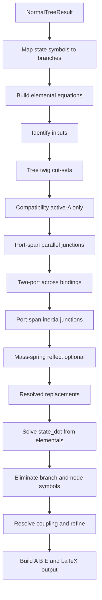

# State-Space Derivation After the Normal Tree

What the app does after a **normal tree** is committed: build constitutive equations, apply continuity and compatibility constraints, then derive **state equations** and matrix form.

Algorithm walkthrough only — no source paths. For file-level references see `docs/state_space_from_normal_tree.md` in the repository.

---

## Prerequisites

Requires a valid normal tree (`status == Ok`), produced automatically or manually. That result provides:

| Field | Meaning |
|-------|---------|
| `treeBranches` | Branches chosen as **tree twigs** (spanning tree) |
| `stateVariables` | Storage symbols (across on tree A-type, through on co-tree T-type) |

**Out of scope here:** how the normal tree is searched, scored, or validated (two-port port rules, manual selection).

**In the app:** **Analyze → Compute State Space** after a normal tree is committed.

---

## Overview



1. **Elemental** equations in node-across form (`V1−V2`, `OmegaJ`, …).
2. **Continuity** from tree cut-sets, then port-span parallel junctions.
3. **Compatibility** — one binding per active A-type source (`V_node = u`).
4. **Two-port across** bindings only (flows stay in elementals + continuity).
5. Optional **mass–spring reflect** through transformer chains.
6. Solve for `state_dot`, eliminate remaining symbols, emit `ẋ = Ax + Bu [+ E u̇]`.

**Important:** across bindings never overwrite continuity or compatibility. Two-port **flow** laws (e.g. `i1 = −Ka·T2`) are **not** copied into the replacement map — that would overwrite cuts like `i1 = i_L`.

---

## Branch types (MIT linear graph)

| Type | Physical role | Elemental equation (generic) | State when… |
|------|---------------|------------------------------|-------------|
| **A** | Inertia, capacitance | `f = k·ẋ` | **In tree** → across variable is a state |
| **T** | Inductance, compliance | `Δe = k·ẋ_flow` | **In co-tree (link)** → through variable is a state |
| **D** | Resistance, damping | `f = k·e` (algebraic) | Never a state |

Element constants (`R`, `L`, `J`, …) can infer type when the branch is still default A-type.

Active sources: **A-type in tree** → effort input; **T-type in co-tree** → flow input.

Two-port transformers add across and through constraints (modulus `k`, e.g. `1/Ka`).

---

## Motor example

PM DC motor: electrical (`R`, `L`, `Vs1`), transformer `1/Ka`, mechanical (`J`, `B`). Open **Examples/Motor.lgm**.

### Graph elements

| Element | Branch | Type | Normal-tree role |
|---------|--------|------|------------------|
| Voltage source | `Vs1` | A (active) | Tree twig → **input** |
| Resistor | `i_R` | D | Tree twig |
| Inductor | `i_L` | T | Co-tree link → **state** `i_L` |
| Transformer | `i1`, `T2` | two-port | `i1` in tree; `T2` in co-tree |
| Inertia | `T_J` | A | Tree twig → **state** `OmegaJ` |
| Damper | `T_B` | D | Co-tree link |

### Normal tree (auto)

- **Tree twigs:** `Vs1`, `i1`, `T_J`, `i_R`
- **Co-tree links:** `i_L`, `T_B`, `T2`
- **States:** `OmegaJ`, `i_L`
- **Input:** `Vs1`

---

## Phase-by-phase algorithm

### Phase A — Validate and map states

Map each normal-tree state symbol to its storage branch.

**Motor:** `OmegaJ ↔ T_J`, `i_L ↔ i_L`.

---

### Phase B — Elemental equations

Constitutive laws in node-across form (not synthetic `*_a` symbols).

**Motor** — constitutive summary:

```
T_J = J*OmegaJ_dot; T_B = B*OmegaJ; V2 - V3 = L*i_L_dot; i_R = (V1 - V2)/R; V3 = OmegaJ/Ka; i1 = -T2*Ka
```

Symbolic form before substitution:

```
0 = T_J - J*OmegaJ_dot
0 = T_B - B*OmegaJ
0 = i_L_dot - V2/L + V3/L
0 = i_R - V1/R + V2/R
0 = V3 - OmegaJ/Ka
0 = i1 + T2*Ka
```

---

### Phase C — Inputs

A-type active branch **in tree** → effort input. T-type active **in co-tree** → flow input.

**Motor:** `Vs1`.

---

### Phase D — Continuity

**Tree twig cut-sets** (skip active A sources; skip port-span twigs that get a junction instead):

For each remaining twig: cut the graph, sum signed through-flows, solve for the twig flow.

**Port-span parallel junction** (co-tree port with parallel user branches):

```
port_flow = −(sum of parallel branch flows)
```

**Motor:**

```
i1 = i_L
i_R = i_L
T2 = -T_B - T_J
```

---

### Phase E — Compatibility

One equation per active A-type source in the tree: driven node across = input symbol. No KVL on co-tree links.

**Motor:** `V1 = Vs1`.

---

### Phase F — Two-port across and port-span inertia

| Rule | Effect |
|------|--------|
| Transformer **across** | e.g. `V3 = OmegaJ/Ka` |
| Port-span A storage (`T_J`) | `T_J = -T_B + i1/Ka` (then `i1 → i_L`) |
| Existing replacements | Never overwritten by two-port flow aliases |

**Motor — resolved replacements:**

```
T_J = -T_B + i_L/Ka
V3 = OmegaJ/Ka
T2 = -i_L/Ka
V1 = Vs1
i_R = i_L
i1 = i_L
```

---

### Phase G — Derive `state_dot`

Substitute replacements into elementals; solve each storage elemental for its `state_dot`.

**Motor:**

| Stage | `OmegaJ_dot` | `i_L_dot` |
|-------|--------------|-----------|
| After T_J row reduction | `0 = -T_B - J·OmegaJ_dot + i_L/Ka` | — |
| Initial solve | `(−T_B + i_L/Ka) / J` | `V2/L − OmegaJ/(L·Ka)` |
| After value substitution | `−B·OmegaJ/J + i_L/(J·Ka)` | `Vs1/L − OmegaJ/(L·Ka) − R·i_L/L` |

---

### Phase H — Elimination and coupling

Eliminate branch flows and node across symbols. Resolve any coupled `state_dot` terms; refine until only states and inputs remain.

**Motor — final:**

```
OmegaJ_dot = -B*OmegaJ/J + i_L/(J*Ka)
i_L_dot    = Vs1/L - OmegaJ/(L*Ka) - R*i_L/L
```

---

### Phase I — Matrix form

Build scalar state equations and LaTeX `ẋ = A x + B u [+ E u̇]` in the **State Space** dock.

**Motor:** order 2, status OK.

---

## Debug output

Run **Compute State Space** from a terminal to see `[state_space]` log lines (`begin`, `continuity`, `replacements_resolved`, `state_dot`, `matrix_form`, …).

---

## Result fields (UI)

| Field | Content |
|-------|---------|
| Elemental equations | Constitutive laws |
| Continuity equations | Flow replacements |
| Compatibility equations | Active A-type bindings |
| State equations | Final `symbol_dot = …` |
| Matrix form | LaTeX `ẋ = Ax + Bu` |

---

## Summary

For **Motor.lgm** with tree `[Vs1, i1, T_J, i_R]`:

1. **Elementals** tie branches to node efforts and two-port laws.
2. **Continuity** sets `i1 = i_L`, `i_R = i_L`, `T2 = −T_B − T_J`, and `T_J = −T_B + i_L/Ka`.
3. **Compatibility** sets `V1 = Vs1`.
4. **Two-port across** adds `V3 = OmegaJ/Ka`; flows stay out of replacements.
5. **State equations** are standard DC-motor dynamics through `Ka`, `J`, `L`, `R`, `B`.
